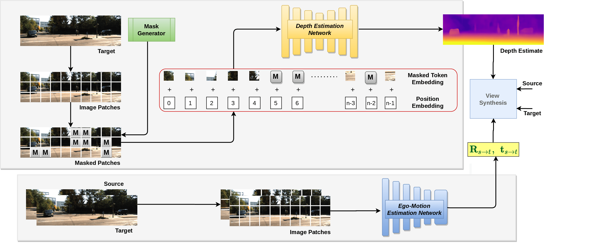

# MIMDepth
This is the official code for [ICRA 2023](https://www.icra2023.org) paper 
[Image Masking for Robust Self-Supervised Monocular Depth Estimation](https://arxiv.org/abs/2210.02357) by
[Hemang Chawla](https://scholar.google.com/citations?user=_58RpMgAAAAJ&hl=en&oi=ao),
[Kishaan Jeeveswaran](https://scholar.google.nl/citations?user=JcqW3_QAAAAJ&hl=en&oi=ao), 
[Elahe Arani](https://scholar.google.nl/citations?user=e_I_v6cAAAAJ&hl=en&oi=ao) and 
[Bahram Zonooz](https://scholar.google.com/citations?hl=en&user=FZmIlY8AAAAJ).

We propose MIMDepth, a method that adapts masked image modeling (MIM) for self-supervised monocular depth estimation

## Cite Our Work
If you find the code useful in your research, please consider citing our paper:
<pre>
@inproceedings{chawla2023image,
	author={H. {Chawla} and K. {Jeeveswaran} and E. {Arani} and B. {Zonooz}},
	booktitle={2023 IEEE International Conference on Robotics and Automation (ICRA)},
	title={Image Masking for Robust Self-Supervised Monocular Depth Estimation},
	location={London, UK},
	publisher={IEEE},
	year={2023}
}
</pre>

## License

This project is licensed under the terms of the MIT license.